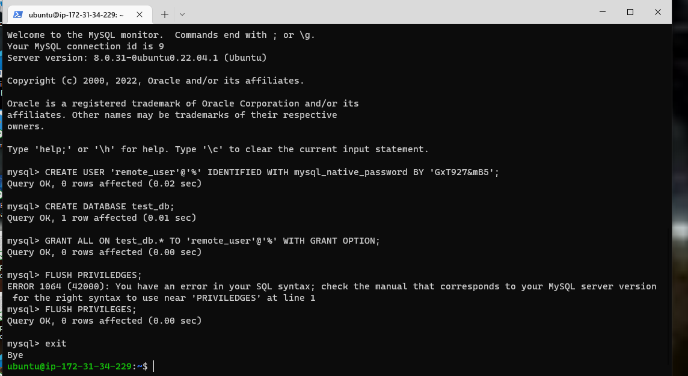

# (STEP 12) PROJECT 5: Client / Server Architecture Using A mySQL Relational Database Management System

## IMPLEMENT A CLIENT SERVER ARCHITECTURE USING MYSQL DATABASE MANAGEMENT SYSTEM (DBMS).

To demonstrate a basic client-server using MySQL Relational Database Management System (RDBMS), follow the below instructions

Create and configure two Linux-based virtual servers (EC2 instances in AWS).

* Login to AWS EC2 Console
* Click on Launch Instance

* Name it Project_5
* Under Application and OS Images select Ubuntu
* Select Ubuntu 22.04 LTS Free Tier
* You can use an existing key but in this case we will create a new key.

  *  Click create new key
  * Name the key whatever you want in out case PBL Project 5
  * Leave everything as defaulted and click create key pair.
* Under Security, leave Create a New Security Group as defaulted.

  

* Select 2 under Number of Instances

  

* Click Launch Instance at the bottom

* The screen below will be displayed.

  

* Click on View Instances

  

* Edit the names of the servers. One as PBL Project_5 MYSQL DB-Server and PBL Project_5 MYSQL Client.

  

## *TASK* – Implement a Client Server Architecture using MySQL Database Management System (DBMS).

On mysql server Linux Server install MySQL Server software.

Interesting fact: MySQL is an open-source relational database management system. Its name is a combination of "My", the name of co-founder Michael Widenius’s daughter, and "SQL", the abbreviation for Structured Query Language.

Run `sudo apt update -y`

Run `sudo apt install mysql-server -y`

We need to enable the service by running the command below.

`sudo systemctl enable mysql`

On mysql client Linux Server install MySQL Client software.

Start the Client and connect.

Run `sudo apt update -y`

Run `sudo apt install mysql-client -y`

*By default, both of your EC2 virtual servers are located in the same local virtual network, so they can communicate to each other using local IP addresses. Use mysql server's local IP address to connect from mysql client. MySQL server uses TCP port 3306 by default, so you will have to open it by creating a new entry in ‘Inbound rules’ in ‘mysql server’ Security Groups. For extra security, do not allow all IP addresses to reach your ‘mysql server’ – allow access only to the specific local IP address of your ‘mysql client’.*

* Click on Instance and select on PBL Project_5 DB-Server > Security > Security groups. Click on Secury groups.

Click on edit inbound rules.

Click on Add Rule.

Select MYSQL/Aurora under Type. Under Source you need to put the IP address of the Client. You can get the IP address from EC2 or run the command ` ip addr show`

The IP address for the Client is currently 172.31.32.229/20.

Click on Save Rules. The below screen will be displayed.

We need to create a database on mysql server (PBL Project_5 DB-Server).

Run `sudo mysql_secure_installation` in PBL Project_5 DB-Server . This  helps to prepare mysql server instance.

For this set-up we will use *GxT927&mB5* as password. We will select Yes.

Select whichever level you want. In my case I will select 1 for medium.

Select Y if you wish to continue with the password. I will click Y to continue.

After putting the password several times , I received the error below.

Follow the setps below to resolve the error.

* Run `sudo mysql` 

* Run `ALTER USER 'root'@'localhost' IDENTIFIED WITH mysql_native_password by 'GxT927&mB5';`

* *Note* : You need to give it a new password that you want based on the policy that you selected before. I selected 1 which is medium.

* Exit mysql .

  

* Now run `sudo mysql_secure_installation` again and it should finish without errors. You will be prompted to input password. Input the password you created , in our case *GxT927&mB5*

* You will be asked to change password for root. Select any letter if you do not want to change . I selected k and and pressed enter.

* You will be prompted to remove enonymous users. I selected y and enter for yes.

  

* Disallow Root login remotely, select Y for yes.

  

* Remove test Databases and access to it - Y for Yes

  

* Reload Privilege Tables Now - Y for yes.

  

* All done screen will be displayed.'

  

Run `sudo mysql`. You might run into an error below like I did.

*ERROR 1045 (28000): Access denied for user 'root'@localhost' (using password:NO)*

To resolve the issue, run `mysql -u root -p`

Create remote_user by running the command;

`CREATE USER 'remote_user'@'%' IDENTIFIED WITH mysql_native_password BY 'GxT927&mB5';`

Now we need to create the database.

Run `CREATE DATABASE test_db;`

Next we need to grant all priviledges on the database named test_db.

`GRANT ALL ON test_db.* TO 'remote_user'@'%' WITH GRANT OPTION;`

Flush the priviledges 

`FLUSH PRIVILEDGES;`

Exit 

At this time the user and database are created.

You might need to configure MySQL server to allow connections from remote hosts.

Run;

`sudo vi /etc/mysql/mysql.conf.d/mysqld.cnf`

Replace ‘127.0.0.1’ to ‘0.0.0.0’ like this:

Save and quit by following the steps below'
* Esc
* Shift :
* wq
* It will show :wq at the bottom. 
* Enter

We now need to restart the service by running the command below.

`sudo systemctl restart mysql`

From mysql client Linux Server (PBL Project_5 Client) connect remotely to mysql server Database Engine without using SSH. You must use the mysql utility to perform this action.

* First connect PBL project_5 Client through EC2.

  

  

  Now run `sudo mysql -u remote_user -h 172.31.34.229 -p`

  Note that the 172.31.34.229 is the Private ip address fro the PBL project_5 DB_Server. -p will allow you to be prompted for password which you had created fro root. The password is *GxT927&mB5*

  The screen below will show that we are connected from mysql client Linux Server remotely to mysql server Database Engine without using SSH.

   

   We now need to confirm that we can perform SQL queries. Run the command below.

   `Show databases;`

   

   Project completed.

